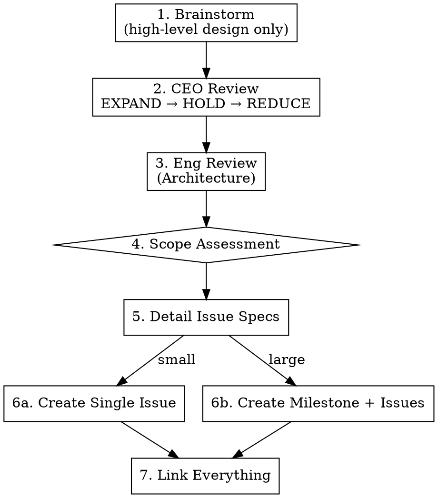

# Creating GitHub Issues

## Overview

Turn ideas into well-scoped GitHub Issues through structured review. Orchestrates: brainstorm → CEO review → Eng review (architecture) → scope assessment → GitHub creation.

Every issue created by this skill has validated scope, reviewed architecture, clear acceptance criteria, and (for multi-issue work) a milestone with design context — so `starting-github-issue` can execute without re-discovering context.

**Announce at start:** "Using creating-github-issues to turn this idea into actionable issues."

**This skill is the GitHub Issues equivalent of `creating-linear-tickets`.** Use this one when the target repo's `CLAUDE.md` specifies GitHub Issues as the tracker. Use `creating-linear-tickets` otherwise.

## Required Input

An idea, feature request, bug report, or initiative. Can be:
- A verbal description ("I want to add Google Calendar integration")
- A Notion doc reference
- An existing GitHub milestone to break down
- A bug report or user feedback

## Fast Path — Small, Well-Scoped Issues

**Not every issue needs the full workflow.** Skip brainstorming and reviews when ALL of these are true:

- The problem is obvious and well-understood (e.g., a specific bug with a known fix)
- The scope is already tight — one change, one area of the codebase
- There's no design ambiguity — no "should we do A or B?" questions
- The user has clearly articulated what they want

**Fast path:** Read the relevant code to understand the current state → create a well-formed issue with problem statement, affected code, solution sketch, and acceptance criteria. No brainstorming, no CEO review, no Eng review.

**Examples of fast-path issues:**
- "Day boundary uses UTC instead of local time" — it's a bug, the fix is clear
- "Add loading spinner to the save button" — tiny UI improvement, no ambiguity
- "Rename `foo` to `bar` across the codebase" — mechanical refactor

**Examples that need the full workflow:**
- "Add Google Calendar integration" — multiple approaches, scope unclear
- "Redesign the daily routine flow" — requires exploring alternatives
- "Add a weekly review feature" — new concept, needs CEO + Eng review

**When in doubt, ask:** "This seems well-scoped enough for a quick issue. Want me to run the full workflow or just create the issue?"

## Workflow (Full)

**IMPORTANT: Reviews happen early, before detailed issue design.** The flow is: high-level design → reviews (challenge scope/architecture) → detailed issue specs. Do NOT write detailed issue descriptions, acceptance criteria, or scope before the reviews have run. The reviews exist to shape what the issues should be.



### Step 1: Brainstorm (High-Level Design)

**REQUIRED SUB-SKILL:** Invoke `superpowers:brainstorming`

Provide the idea as context. Brainstorming should produce a **high-level design** — the shape of the work, major components, key decisions, and a rough issue breakdown (titles + one-line descriptions). Do NOT write detailed issue specs (full acceptance criteria, detailed scope, etc.) at this stage — that comes after reviews.

Output should be:
- Key design decisions and trade-offs explored
- Rough dependency graph
- Issue titles + one-line summaries (not full specs)

**Do NOT save a design doc yet** — the design will be refined by the review phases.

### Step 2: CEO Review

**REQUIRED SUB-SKILL:** Invoke `plan-review-ceo`

Pass the brainstorming output. The CEO review runs EXPAND → HOLD → REDUCE and produces:
- **Building now** — what goes into issues
- **Building later** — deferred with rationale
- **Not building** — explicitly killed

This may add, remove, or reshape issues from the brainstorming output.

### Step 3: Eng Review (Architecture)

**REQUIRED SUB-SKILL:** Invoke `plan-review-eng` in **planning mode**

Pass the validated scope from CEO review. The Eng review produces:
- ASCII architecture diagram
- File list (create/modify)
- Failure modes
- Dependency graph for issue ordering
- "What already exists" section

### Step 4: Scope Assessment

Auto-detect whether this is a single issue or a milestone with multiple issues:

| Signal | Single issue | Milestone + issues |
|--------|--------------|-------------------|
| Architecture touches | 1-2 areas | 3+ distinct areas |
| "Building now" items | 1-3 related | 4+ or separable |
| Natural issue count | 1 | 2+ vertical slices |
| Has "Building later" list | No or trivial | Yes, meaningful |

**Always ask to confirm** before creating: "This looks like [single issue / a milestone with N issues]. Sound right?"

### Step 5: Detail Issue Specs

**Only now — after reviews have validated scope and architecture — write detailed issue descriptions.** For each issue, flesh out:
- Full scope (what's included, what's not)
- Acceptance criteria (specific, testable)
- Dependencies on other issues
- Testing requirements
- Architecture notes from Eng review

Present each issue to the user for validation before creating in GitHub.

### Step 6a: Create Single Issue

Determine the repo from the working directory (`gh repo view --json nameWithOwner -q .nameWithOwner`) or use an explicit `--repo` flag.

Ensure required labels exist. If any label below doesn't exist, create it first:

```bash
# Check existing labels
gh label list

# Create any missing labels (example — adapt to what's actually missing)
gh label create "priority:urgent" --color "b60205" --description "Urgent priority"
gh label create "priority:high"   --color "d93f0b" --description "High priority"
gh label create "priority:medium" --color "fbca04" --description "Medium priority"
gh label create "priority:low"    --color "0e8a16" --description "Low priority"
gh label create "status:blocked"  --color "b60205" --description "Blocked on another issue"
```

Create the issue:

```bash
gh issue create \
  --title "<Descriptive, action-oriented title>" \
  --body "<See issue template below>" \
  --label "<bug|enhancement|documentation>" \
  --label "priority:<urgent|high|medium|low>"  # optional
```

Capture the issue URL/number from output.

### Step 6b: Create Milestone + Issues

1. **Create or find milestone.** GitHub CLI has no direct milestone command, so use the REST API:
   ```bash
   OWNER_REPO=$(gh repo view --json nameWithOwner -q .nameWithOwner)
   gh api -X POST "repos/$OWNER_REPO/milestones" \
     -f title="<milestone title>" \
     -f description="<project-level design context: architecture, scope decisions, success criteria, failure modes>" \
     -f state="open"
   ```
   Put **project-level context** (architecture, scope decisions, success criteria, failure modes) in the **milestone description** — this is the design doc, not a separate document.

2. **Create vertical-slice issues** — each delivers complete user value:
   - Include frontend + backend + tests in a single issue
   - Order by dependency graph from Eng review
   - Each issue is self-contained: all requirements, scope, and acceptance criteria are in the issue body itself
   - Attach to the milestone with `--milestone "<title>"` on `gh issue create`

3. **Create "Building later" issues** — separate backlog issues (no milestone, or a separate "Later" milestone) with rationale preserved from CEO review.

4. **Add dependency notes** — in issue bodies: "Depends on #<number>" where ordering matters. Also add the `status:blocked` label to issues that can't start yet (create it if missing — see Step 6a).

### Step 7: Link Everything

- If a milestone was created, confirm all issues are attached (`gh issue list --milestone "<title>"`)
- Report back: list of created issues with numbers, titles, and URLs

**No separate design document.** Milestone-level design context lives in the milestone description. Issue-level requirements live in the issue body. This avoids information being split across multiple places.

## Issue Body Template

```markdown
## Problem
<Problem statement — why are we building this?>

## Scope
<What's included, what's not. Specific enough for an implementer to work without asking questions.>

## Acceptance Criteria
- [ ] <Specific, testable condition>
- [ ] <Each criterion maps to a verifiable outcome>
- [ ] <Include both happy path and key edge cases>

## Testing
<Testing requirements — unit tests, integration tests, test runs>

## Dependencies
<"Depends on #N" if applicable, or "None">

## Not In Scope
<Items explicitly deferred or cut>
```

**No separate design document.** Milestone-level context (architecture, data flow, scope decisions, failure modes, success criteria) lives in the milestone description. Each issue is self-contained with its own requirements.

## Label Conventions

GitHub's stock labels map to the global Bug/Feature/Improvement convention as follows:

| Global convention | GitHub label |
|-------------------|--------------|
| Bug | `bug` |
| Feature | `enhancement` |
| Improvement | `enhancement` (GitHub has no separate label; use `enhancement` for both) |
| Documentation | `documentation` |

If the repo has a custom `improvement` label already, use that instead.

## Common Mistakes

### Creating issues without acceptance criteria
- **Problem:** Executor doesn't know what "done" looks like
- **Fix:** Every issue gets specific, testable acceptance criteria derived from the review phases

### Horizontal instead of vertical issue slicing
- **Problem:** "Create API route", "Create component", "Create hook" — none deliver value alone
- **Fix:** Each issue is a vertical slice: backend + frontend + tests = usable feature

### Skipping reviews for "obvious" features
- **Problem:** Assumptions go unchallenged, scope creeps during implementation
- **Fix:** Run the full workflow. CEO review catches bad assumptions, Eng review catches architectural issues.

### Not preserving rationale for deferred items
- **Problem:** "Building later" items lose context, become meaningless backlog entries
- **Fix:** Include WHY it was deferred and WHAT would trigger building it

### Forgetting to create status/priority labels before using them
- **Problem:** `gh issue create --label "status:blocked"` fails if the label doesn't exist
- **Fix:** Check `gh label list` first; create any missing labels with `gh label create` before using them

## Red Flags
- "This is just one quick issue, we don't need all this"
- "The acceptance criteria are obvious"
- "Let me just create the issues and start coding"
- "We can figure out the architecture during implementation"

**All of these mean: Run the workflow. Cheap questions now save expensive rework later.**
