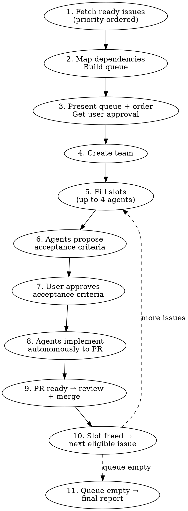

# GitHub Issue Todo Runner

## Overview

Work through all ready issues in a GitHub repo. Fetches open issues that aren't in progress, aren't in review, and aren't blocked; maps dependencies; and runs a rolling queue of agents — spawning new ones as slots open up. Each agent pauses for acceptance criteria approval before implementing.

**This skill is the GitHub Issues equivalent of `linear-todo-runner`.** Use this one when the target repo's `CLAUDE.md` specifies GitHub Issues as the tracker.

## Status Mapping

"Todo" in this skill means: **open issue with no `status:*` label** (i.e., in the backlog, not actively being worked). Issues with any of the following are excluded from the queue:

- `status:in-progress` — someone's already working on it
- `status:in-review` — PR open
- `status:blocked` — waiting on a dependency

See the "Label Setup" section in `starting-github-issue` for creating these labels if they don't exist.

## When to Use

- 2+ open issues with no status label, ready to work on
- You want to maximize throughput across your backlog
- User says "run through my issues", "work my todos", etc.

## When NOT to Use

- Single issue — use `starting-github-issue` directly
- Issues need design decisions before scoping — run those through `creating-github-issues` first

## Process



### Step 1: Fetch Ready Issues

Fetch all open issues that don't have any `status:*` label:

```bash
gh issue list \
  --state open \
  --search '-label:"status:in-progress" -label:"status:in-review" -label:"status:blocked"' \
  --limit 100 \
  --json number,title,body,labels,milestone,url
```

Sort by priority labels (highest first):
- `priority:urgent` → 1
- `priority:high` → 2
- `priority:medium` → 3
- `priority:low` → 4
- no priority label → 5 (ties broken by issue number, lowest first)

Extract per issue: number, title, full body, priority, type labels (bug/enhancement/documentation), milestone, URL.

### Step 2: Map Dependencies & Build Queue

Read every issue's full body. Identify:
- **Explicit dependencies** — "Depends on #<number>" / "Blocked by #<number>" lines in the body
- **Implicit dependencies** from context (e.g., "table must exist before frontend can query it")
- **Shared code areas** that would cause merge conflicts if worked simultaneously

Build a **priority queue** — a flat ordered list where:
- Higher priority issues come first
- Issues with unmet dependencies are marked as blocked (they become eligible once their dependency's PR merges)
- Issues touching the same files/areas are flagged as conflicting (only one can run at a time)

**Dependency check:** for each "Depends on #N" reference, check if #N is closed:
```bash
gh issue view <N> --json state --jq .state
```
If OPEN, the dependent issue is blocked.

### Step 3: Present Queue for Approval

Show the user:

| # | Issue | Priority | Area | Blocked By | Conflicts With |
|---|-------|----------|------|------------|----------------|
| 1 | #15 Add homepage hero | High | frontend | — | — |
| 2 | #22 Rework cart API | Medium | backend | — | #27 |
| ... | ... | ... | ... | ... | ... |

Highlight which issues will start immediately (first 4 eligible) and which are waiting on dependencies.

**Wait for user approval before proceeding.** User may reorder or remove issues.

### Step 4: Create Team

```
TeamCreate → team name: "issue-runner"
```

### Step 5: Fill Agent Slots

Maintain up to **4 concurrent agents**. When a slot opens, pick the next eligible issue from the queue:
- Not blocked by an open dependency
- Not conflicting with a currently-running issue
- Highest priority among eligible

For each issue spawned:

1. **Add `status:in-progress` label to the issue**
   ```bash
   gh issue edit <number> --add-label "status:in-progress"
   ```
2. Spawn the agent

```
Task tool:
  subagent_type: "general-purpose"
  team_name: "issue-runner"
  name: "agent-issue-{number}"  (e.g., "agent-issue-170")
  mode: "default"
```

**Agent prompt template:**

```
You are working on GitHub issue #{NUMBER}: "{TITLE}"

Repo: {OWNER}/{REPO}
Issue URL: {URL}

## Issue Body
{FULL_BODY}

## Labels
{LABELS}

## Milestone (if any)
{MILESTONE_TITLE_AND_DESCRIPTION}

## Phase 1: Acceptance Criteria (STOP after this)

Read the issue body and explore the relevant codebase. Then propose specific,
testable acceptance criteria for this issue. Format as a numbered checklist.

Send your proposed acceptance criteria back to the team lead using SendMessage.
Do NOT proceed to implementation until the team lead approves your criteria.

## Phase 2: Implementation (after approval)

Once your acceptance criteria are approved, follow the `starting-github-issue`
skill workflow with these modifications:

- **Skip Steps 1-2** (fetch issue, add status:in-progress) — the lead already did this.
- **Skip Step 4** (brainstorm) — use the approved acceptance criteria as your design.
- **Start at Step 3** (create worktree) and continue through Step 12.
  - Worktree: git worktree add {WORKTREE_PATH} -b {BRANCH_NAME} origin/main
  - If the project has multiple repos, create worktrees FROM each repo's directory.
  - ALWAYS include `Closes #{NUMBER}` in the PR body so merge auto-closes the issue.

After Step 12 (status:in-review), also:
- Send PR URL, code review summary, and implementation summary to team lead via SendMessage.
- **Stay alive after submitting PR** — do NOT exit. Wait for feedback from the
  team lead. If they request changes, push fixes to YOUR branch and report back.
  Only shut down when the team lead sends a shutdown request (meaning the PR was
  merged or cancelled).

## Important
- Check the installed version of frameworks in package.json before making
  assumptions about API conventions
- NEVER commit directly to main — ALL changes go through a worktree + branch + PR
- If the team lead sends you feedback or fix requests after your PR is submitted,
  push the fix to YOUR branch (the PR branch), NOT to main
- NEVER swap to status:in-review until CI passes
- **UI changes require screenshot verification** — whenever you make frontend/UI
  changes, take a Playwright screenshot BEFORE pushing and verify the result
  visually. Start a dev server (ensure env vars are set), then use Playwright
  to screenshot the affected pages. Share the screenshot path with the team
  lead. Do NOT push UI changes without visual verification.
```

### Step 6-7: Acceptance Criteria Approval

Each agent sends proposed acceptance criteria via SendMessage. The lead:

1. Receives criteria from each agent
2. Presents criteria to the user **one at a time** — do NOT batch multiple agents' criteria into a single message. Present one, wait for the user's response, then present the next.
3. User approves, modifies, or rejects each
4. Lead sends approval (or revised criteria) back to each agent via SendMessage

### Step 8: Agents Implement

After approval, agents proceed autonomously through implementation → test → PR → code review.

Agents should run the `superpowers:code-reviewer` on their own PR and fix Critical/Important issues before reporting back.

Monitor via TaskList. If an agent reports a blocker, help resolve it.

### Step 9: PR Review & Merge

When an agent completes and reports its PR:

1. Present the PR and code review findings to the user
2. User reviews (in GitHub or via diffs)
3. Address any review feedback — **send feedback to the agent** via SendMessage so they can push fixes to their branch. The agent stays alive for this purpose.
4. **Wait for user to approve**
5. Merge: `gh pr merge <number> --squash --delete-branch`
   - The `Closes #N` reference in the PR body auto-closes the issue on merge
6. Clean up worktree
7. **Verify issue is closed** and remove stale labels:
   ```bash
   gh issue view <number> --json state --jq .state  # should be CLOSED
   gh issue edit <number> --remove-label "status:in-review"  # labels don't auto-clear on close
   ```
   If the issue is still OPEN (PR body missed `Closes #N`), close manually with `gh issue close <number> --comment "Fixed by #<pr-number>"`.
8. **Shut down the agent** — send shutdown_request only after merge

**Do this per-PR as they finish** — don't wait for all agents to complete.

**After merging, check for conflicts on other open PRs:**
Run `gh pr view <number> --json mergeable --jq .mergeable` for each open PR. If any show `CONFLICTING`, **send the rebase instructions to the existing agent** that owns that PR — do NOT spawn a new agent. The original agent is still alive and has full context.

### Step 10: Fill Freed Slot

After a PR merges:
1. **Check open PRs for merge conflicts** — run mergeable check on all open PRs and send rebase instructions to affected agents
2. **Check if any blocked issues are now unblocked** — if the merged PR closed an issue that another issue's body listed as "Depends on #N", that dependent issue is now eligible. Optionally remove its `status:blocked` label:
   ```bash
   gh issue edit <dependent-number> --remove-label "status:blocked"
   ```
3. **Re-fetch ready issues** — the user may have added new issues during the run. Re-run the query from Step 1 to pick up any additions.
4. Pick the next eligible issue from the queue (including any newly added ones)
5. Spawn a new agent (go to Step 5)

**Keep the runner going until ALL ready issues are complete** — don't stop after the initial batch. The queue is live and grows as the user adds issues. Only report final summary when there are truly no more ready issues and all agents are done.

### Step 11: Final Report

When the queue is empty and all agents are done, report:

| Issue | PR | Status |
|-------|-----|--------|
| #15 | #42 | merged |
| #22 | #43 | merged |
| ... | ... | ... |

Shut down team: SendMessage type "shutdown_request" to each agent, then TeamDelete.

## Key Rules

- **Rolling queue** — don't wait for all agents to finish; fill slots as they open
- **Priority ordering** — `priority:urgent` → `high` → `medium` → `low` → no label determines queue position
- **Dependency gating** — issues with open "Depends on #N" references only become eligible after #N's PR is merged (auto-close via `Closes #N` or manual close)
- **Conflict avoidance** — issues touching the same code areas don't run simultaneously
- **Max 4 agents simultaneously** — resource constraints
- **Each agent gets its own worktree** — no shared workspace
- **Agents STOP after proposing acceptance criteria** — user must approve before implementation
- **User approves queue order before starting** — no surprises
- **Preserve existing type and priority labels** when updating issue status — only swap `status:*` labels
- **Lead NEVER does implementation directly** — all work (code, tests, fixes, CI debugging, ad-hoc bugfixes, quick UI tweaks) must be delegated to agents or subagents. The lead coordinates, reviews, and communicates with the user. If the user reports a bug or requests a change during the run, spawn a subagent to fix it — do NOT edit code yourself, even if it seems trivial.
- **NEVER commit directly to main** — every change, no matter how small, must go through a PR. If the user gives feedback on a completed PR, push the fix to that PR's branch — do NOT commit to main. If the PR is already merged and a fix is needed, spawn a subagent to create a new worktree + branch + PR for the fix. Zero exceptions.
- **Every PR must include `Closes #N`** — this auto-closes the issue on merge and keeps the runner's state consistent

## Quick Reference

| Step | Action | Tool |
|------|--------|------|
| Fetch issues | Get open issues with no status label | `gh issue list --search '-label:"status:in-progress" -label:"status:in-review" -label:"status:blocked"'` |
| Full bodies | Issue body is already in the list output | Use `--json body` in the fetch step |
| Map dependencies | Parse "Depends on #N" from bodies, check state of each | `gh issue view <N> --json state` |
| Present queue | Show order + deps to user | Direct output |
| Create team | Set up coordination | `TeamCreate` |
| Start work on issue | Add `status:in-progress` | `gh issue edit <N> --add-label "status:in-progress"` |
| Spawn agent | Fill an open slot | `Task` (general-purpose) |
| AC approval | Review with user | `SendMessage` |
| PR merge | Per-PR as they finish | `gh pr merge <N> --squash --delete-branch` (auto-closes issue via `Closes #N`) |
| Verify closed | Confirm state=CLOSED | `gh issue view <N> --json state` |
| Unblock dependents | Remove `status:blocked` where applicable | `gh issue edit <N> --remove-label "status:blocked"` |
| Fill slot | Next eligible issue | Re-query + spawn |
| Report | Final summary table | Direct output |
| Cleanup | Shut down team | `SendMessage` (shutdown) + `TeamDelete` |
