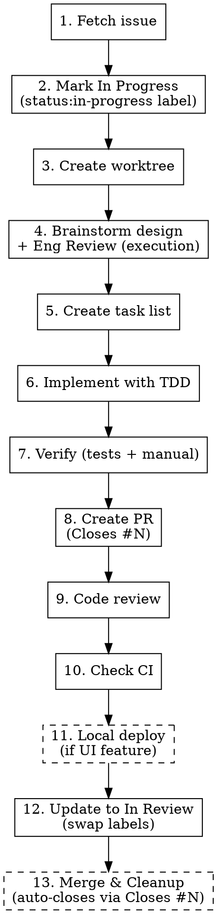

# Starting Work on a GitHub Issue

## Overview

Complete end-to-end workflow for GitHub Issues: fetch → in progress → worktree → brainstorm → task list → TDD → verify → PR → code review → CI → in review.

**Announce at start:** "I'm using the starting-github-issue skill to set up for this issue."

**This skill is the GitHub Issues equivalent of `starting-linear-ticket`.** Use this one when the target repo's `CLAUDE.md` specifies GitHub Issues as the tracker. Use `starting-linear-ticket` otherwise.

## Required Input

User provides issue reference:
- Issue number (`#63`, `63`)
- Full reference (`grallesninot/botiga#63`) for cross-repo disambiguation
- URL (`https://github.com/owner/repo/issues/63`)

## Status ↔ Label Mapping

GitHub issues have no built-in state beyond open/closed. This skill uses labels for workflow state:

| Linear state | GitHub equivalent |
|---|---|
| Backlog / Todo | open, no `status:*` label |
| In Progress | `status:in-progress` label |
| In Review | `status:in-review` label |
| Blocked | `status:blocked` label |
| Done | closed issue |

If `status:in-progress` / `status:in-review` / `status:blocked` labels don't exist in the repo, create them on first use (see "Label Setup" at the bottom).

## When to Use a Team

Before starting the workflow, evaluate whether this work should use a **team of parallel agents**. Use a team when:

### Use a Team When

- **Multiple independent issues** — User asks to work on 2+ issues at once. Each agent gets its own worktree and runs the full workflow independently.
- **Cross-repo changes** — A single issue requires changes across multiple repos. Each agent works in a different repo/worktree.
- **Large issue with independent subtasks** — An issue has clearly separable pieces (e.g., "add 3 new API endpoints" where each endpoint is independent).

### Don't Use a Team When

- **Single issue, single repo** — Standard workflow is sufficient.
- **Tightly coupled changes** — Work where each step depends on the previous step's output (e.g., schema change → backend update → frontend update in sequence).
- **Small or quick issues** — The overhead of team coordination exceeds the benefit.

### Team Setup

When using a team, the lead agent should:

1. **Fetch all issues** from GitHub first to understand scope and dependencies
2. **Create a team** with `TeamCreate`
3. **Create tasks** from issue requirements with `TaskCreate`
4. **Spawn teammate agents** with `Task` tool (`subagent_type: "general-purpose"`, include `team_name`)
   - Each teammate gets: issue number, requirements, acceptance criteria, target repo, branch name
   - Each teammate runs the full workflow (worktree → brainstorm → TDD → verify → PR → code review)
5. **Coordinate** — monitor progress, resolve blockers, handle cross-repo dependencies
6. **Report back** — collect PR URLs and update all issues

### Team Agent Naming

Name agents by their responsibility:
- `issue-140-agent` — for issue-based agents
- `frontend-agent` / `backend-agent` / `pipeline-agent` — for repo-based agents

### Example: Multiple Issues

```
User: "Start #140, #141, and #142"

Lead:
  1. Fetch all 3 issues from GitHub
  2. Verify they're independent (no "Depends on" relationships)
  3. Mark all 3 with status:in-progress
  4. TeamCreate → "issue-batch"
  5. Spawn 3 agents, each with full issue context
  6. Each agent: worktree → brainstorm → TDD → verify → PR → code review
  7. Lead collects PRs, updates each issue to status:in-review
```

### Example: Cross-Repo Issue

```
User: "Start #150" (requires changes across multiple repos)

Lead:
  1. Fetch issue, brainstorm overall design
  2. Identify which changes go to which repo
  3. TeamCreate → "issue-150"
  4. Spawn agents per repo with their slice of the design
  5. Define task dependencies (e.g., backend blocked by schema changes)
  6. Each agent creates a PR in their respective repo
  7. Lead links all PRs in the issue with `Closes owner/repo#150` refs
```

## Workflow



### Step 1: Fetch Issue from GitHub

```bash
gh issue view <number> --json number,title,body,labels,milestone,assignees,url
```

For cross-repo issues, add `--repo <owner>/<repo>`.

Extract and summarize:
- **Title**
- **Body** (requirements, acceptance criteria)
- **Labels** (type: `bug`/`enhancement`/`documentation`; priority: `priority:*`; status: `status:*`)
- **Milestone** (if any — may contain project-level design doc)
- **Any "Depends on #N" references in the body**

If the issue has a milestone, fetch its description too for project-level context:
```bash
OWNER_REPO=$(gh repo view --json nameWithOwner -q .nameWithOwner)
gh api "repos/$OWNER_REPO/milestones" --jq '.[] | select(.title == "<milestone title>") | .description'
```

If the issue isn't found: ask the user to verify the number or run `gh auth status`.

**Check for acceptance criteria.** If the issue body does NOT have clear acceptance criteria (specific, testable conditions that define "done"), STOP and ask the user to provide them before proceeding. Do not invent acceptance criteria or proceed without them — they drive the design, tests, and verification steps downstream.

### Step 2: Mark as In Progress

```bash
gh issue edit <number> --add-label "status:in-progress"
```

Preserve existing labels (bug/enhancement/documentation, priority, milestone). Do not use `--remove-label` for anything other than other `status:*` labels.

If `status:in-progress` doesn't exist, create it first (see "Label Setup").

### Step 3: Create Git Worktree

**REQUIRED:** Invoke `superpowers:using-git-worktrees` skill.

GitHub Issues have no `branchName` field (unlike Linear). Generate one from the type label + issue number + title slug:
- Label `bug` → `fix/<number>-<slug>`
- Label `enhancement` (feature-like) → `feature/<number>-<slug>`
- Label `enhancement` (refactor/perf/chore) → `refactor/<number>-<slug>` or `chore/<number>-<slug>` — pick based on the nature of the change
- Label `documentation` → `docs/<number>-<slug>`

Where `<slug>` is kebab-case from the issue title, trimmed to ~40 chars.

### Step 4: Brainstorm Design + Technical Review

**REQUIRED:** Invoke `superpowers:brainstorming` skill.

Provide context from the issue:
- Issue requirements and acceptance criteria
- Milestone description (if attached)
- Current codebase state (explore relevant files)
- Any constraints from "Depends on #N" references

Brainstorming will:
- Ask clarifying questions one at a time
- Propose 2-3 approaches with trade-offs
- Present design incrementally for validation
- Write design doc to `docs/plans/YYYY-MM-DD-<topic>-design.md`

**After brainstorming completes:**

**REQUIRED SUB-SKILL:** Invoke `plan-review-eng` in **execution mode**

This reviews the design for code quality, test strategy, and performance — concerns that are best addressed when you're in the worktree looking at actual code. The review produces:
- Edge cases to handle
- Codepath diagram with test coverage mapping
- Performance concerns
- Updated test plan matching acceptance criteria

The test plan from this review feeds directly into Step 6 (TDD implementation).

### Step 5: Create Task List

**REQUIRED:** Before writing any code, create a `TaskCreate` todo list that breaks the design into implementation tasks.

Based on the design from brainstorming, create tasks for:
- Each piece of functionality to implement (API endpoints, components, pages, etc.)
- A verification task (run full test suite + TypeScript + build)
- A PR creation task

Set up dependencies with `TaskUpdate` (e.g., verification blocked by implementation tasks, PR blocked by verification).

Update task status as you work: `in_progress` when starting, `completed` when done. This gives the user visibility into progress.

### Step 6: Implement with Subagents

**REQUIRED:** Use subagents (Task tool) to implement each task from the task list.

After creating the task list in Step 5, dispatch implementation tasks to subagents:

1. **Identify independent tasks** — tasks that don't depend on each other can run in parallel
2. **Dispatch each task** using `Task` tool with `subagent_type: "general-purpose"`
3. **Include full context** in each subagent prompt:
   - The worktree path (so they edit the right files)
   - Which files to modify and what changes to make
   - The acceptance criteria for that task
   - Instructions to follow TDD (RED → GREEN → REFACTOR)
4. **Run independent tasks in parallel** — launch multiple Task calls in a single message
5. **Run dependent tasks sequentially** — wait for blockers to complete first
6. **Update task status** — mark tasks `completed` as subagents finish

**Subagent prompt template:**
```
You are working in the worktree at: <worktree-path>

Task: <task description>

Files to modify:
- <file path> — <what to change>

Acceptance criteria:
- <criterion 1>
- <criterion 2>

## How to Work

1. Read the project's `.claude/CLAUDE.md` — it has a "Verification Commands"
   section with the exact commands you must run. These mirror CI.
2. Follow TDD:
   a. Write failing test first
   b. Implement minimal code to pass
   c. Refactor if needed

## Verification Gate (mandatory before reporting success)

Run ALL verification commands from the project's `.claude/CLAUDE.md`.
Every check must pass.

If any check fails:
1. Read the error output carefully
2. Diagnose the root cause (wrong approach vs. bug)
3. Fix the issue
4. Re-run ALL checks
5. Repeat up to 3 attempts

## Escalation

If after 3 fix attempts a check still fails, STOP and report back with:
- Which check is failing
- The exact error output
- What you tried (all 3 attempts)
- Your hypothesis for why it's still failing

Do NOT report success if any verification check is failing.

## Report Format

When done, report:
- What you implemented
- What you tested and verification gate results (all checks)
- Files changed
- Any concerns
```

**When NOT to use subagents:**
- Tasks that require back-and-forth with the user (clarification, approval)
- Tasks where you need to see the result before deciding next steps
- Very small changes (1-2 line edits) where the overhead isn't worth it

**Note on test types:** Unit tests are preferred when possible. For UI/visual bugs where e2e tests are flaky or unreliable, document that manual testing will be used in Step 7.

### Step 7: Verify Before Completion

**REQUIRED:** Invoke `superpowers:verification-before-completion` skill, or dispatch a Bash subagent to run verification.

**Automated verification:**
Run ALL commands from the project's `.claude/CLAUDE.md` → "Verification Commands" section. These mirror CI exactly and include tests, type checking, linting, and any project-specific checks. Every command must pass.

**E2E tests (REQUIRED if they exist):**
If the project has E2E tests:
1. Start required servers (e.g., `langgraph dev`, `npm run dev`)
2. Run E2E test suite (e.g., `pytest tests/*_e2e.py -v -s`)
3. Wait for all E2E tests to pass before creating PR
4. Stop servers after tests complete

**Chat/agent backend changes:**
When modifying agent behavior (system prompt, tool routing, fallback logic, tools), write E2E tests that verify the agent makes the right tool calls with the right arguments.

**Manual verification (for UI/visual bugs):**
If the bug is visual or e2e tests are unreliable:
1. Start required servers locally (backend + frontend)
2. Reproduce the original bug scenario
3. Verify the fix works
4. Document what was tested in the PR description

**Local deploy for user manual testing:**
For UI features, new pages, or any user-facing changes — after creating the PR and running code review, offer to deploy locally so the user can manual test:
1. Ensure required services are running (e.g., `supabase status`)
2. Copy `.env.local` from main repo to worktree if missing
3. Start the dev server in the worktree: `npm run dev` (run in background)
4. Tell the user the URL (e.g., `http://localhost:3000`) and what to test
5. Wait for user feedback before marking as "In Review"
6. Stop the dev server after user confirms testing is complete

### Step 8: Create Pull Request

Push branch and create PR. **Always include `Closes #<number>` in the body** so merging auto-closes the issue:

```bash
git push -u origin <branch-name>

gh pr create --title "#<number>: <issue-title>" --body "$(cat <<'EOF'
## Summary
<2-3 bullets from the design doc>

## Test Plan
- [ ] <verification steps from TDD>

Closes #<number>

🤖 Generated with [Claude Code](https://claude.com/claude-code)
EOF
)"
```

For cross-repo closure: `Closes owner/repo#<number>`.

Capture the PR URL from output.

### Step 9: Code Review

**REQUIRED:** Invoke `superpowers:requesting-code-review` skill OR use the `superpowers:code-reviewer` agent.

After creating the PR, run a code review before checking CI. This catches logic errors, security issues, missing edge cases, and style problems early — before CI runs and before marking as "In Review".

**How to run the review:**
- Use the Task tool with `subagent_type: "superpowers:code-reviewer"` to spawn a review agent
- Provide the PR number, worktree path, and a summary of what was changed
- The reviewer will read the diff and report issues categorized as Critical / Important / Suggestion

**After review:**
- **Critical issues** — must fix before proceeding. Push fixes, re-run review if needed.
- **Important issues** — should fix. Push fixes.
- **Suggestions** — nice to have. Fix if quick, otherwise note for follow-up.

Present the review findings to the user for their own review before proceeding. Do NOT skip ahead — the user should see the review results and approve before moving to CI.

### Step 10: Check CI

After code review is addressed, verify CI checks pass before marking as In Review:

```bash
gh pr checks <pr-number> --watch
```

- If checks **pass**: proceed to Step 11
- If checks **fail**: read the failure logs with `gh run view <run-id> --log-failed`, fix the issue, push, and re-check
- Don't leave a PR in "In Review" with failing CI — fix it first

```bash
# View failure details
gh run view <run-id> --repo <owner/repo> --log-failed
```

### Step 11: Local Deploy for Manual Testing

**When:** The issue involves UI features, new pages, or user-facing changes.
**Skip when:** Backend-only changes, type-only changes, or no visual component.

1. Ensure required services are running (e.g., `supabase status`)
2. Copy `.env.local` from main repo to worktree if missing
3. Start the dev server in the worktree (`npm run dev`, run in background)
4. Tell the user the URL and what to test (specific flows from acceptance criteria)
5. Wait for user feedback before proceeding
6. Fix any issues found during manual testing
7. Stop the dev server after user confirms

### Step 12: Update Issue to In Review

Swap the status label (remove `status:in-progress`, add `status:in-review`):

```bash
gh issue edit <number> \
  --remove-label "status:in-progress" \
  --add-label "status:in-review"
```

You do NOT need to paste the PR URL into the issue body — GitHub auto-links PRs that reference the issue via `Closes #N`. Verify with `gh issue view <number>` (the "Development" sidebar will show the PR).

Report completion with PR URL.

### Step 13: Merge, Deploy & Cleanup

**Trigger:** User says "merge", "merge the PR", or "ship it". Can also be invoked directly mid-conversation for any open PR.

**This is the complete end-of-issue ceremony. Execute all steps in order — don't skip any.**

**Project override:** If the project has a `land-and-deploy` skill, invoke it instead of following the steps below. The project skill handles deploy monitoring and canary verification specific to that project's infrastructure.

1. **Confirm PR number** with the user if ambiguous (multiple PRs open)

2. **Verify CI is green:**
   ```bash
   gh pr checks <pr-number>
   ```
   If checks are failing, fix first — do NOT merge with red CI.

3. **Merge the PR:**
   ```bash
   gh pr merge <pr-number> --squash --delete-branch
   ```
   If the PR body contains `Closes #<number>`, the issue closes automatically on merge — no manual issue close needed.

4. **Monitor deploy** (if project has deploy infrastructure):
   - Wait for deployment to complete (check GitHub deployment status or platform CLI)
   - Verify deployment succeeded before proceeding

5. **Canary verification** (if project has a `canary` skill):
   - Invoke the project's `canary` skill to verify production health
   - If canary reports degradation, alert user and offer revert
   - If healthy, proceed to cleanup

6. **Stop any running servers** started during verification (dev servers, Supabase, etc.)

7. **Clean up worktree:**
   ```bash
   git worktree remove <worktree-path> --force
   ```

8. **Return to main and pull latest:**
   ```bash
   cd <main-repo-path>
   git checkout main
   git pull origin main
   ```

9. **Verify issue closed:** The `Closes #N` reference should have auto-closed the issue. Confirm:
   ```bash
   gh issue view <number> --json state --jq .state
   ```
   Should report `CLOSED`. If still `OPEN` (e.g., the PR body was missing `Closes #N`), close manually:
   ```bash
   gh issue close <number> --comment "Fixed by #<pr-number>"
   ```
   Also remove any `status:in-review` label (labels don't auto-clear on close):
   ```bash
   gh issue edit <number> --remove-label "status:in-review"
   ```

10. **Report completion:** Confirm to user: PR merged, deploy verified, issue closed, worktree cleaned.

**Don't leave worktrees hanging** — they consume disk space and cause confusion in future sessions.

## Quick Reference

| Step | Action | Skill/Tool |
|------|--------|------------|
| 1 | Fetch issue | `gh issue view` |
| 2 | Mark in progress | `gh issue edit --add-label "status:in-progress"` |
| 3 | Create worktree | `superpowers:using-git-worktrees` |
| 4 | Design + Technical Review | `superpowers:brainstorming` then `plan-review-eng` (execution mode) |
| 5 | Create task list | `TaskCreate` + `TaskUpdate` for dependencies |
| 6 | Implement | Subagents (`Task` tool, `general-purpose`) with TDD |
| 7 | Verify (unit + E2E + manual) | Subagent (`Bash`) or `superpowers:verification-before-completion` |
| 8 | Create PR (with `Closes #N`) | `gh pr create` |
| 9 | Code review | `superpowers:code-reviewer` agent |
| 10 | Check CI | `gh pr checks --watch` → fix failures if any |
| 11 | Local deploy (if UI) | `npm run dev` in worktree → user manual tests → wait for feedback |
| 12 | Swap to In Review | `gh issue edit --remove-label "status:in-progress" --add-label "status:in-review"` |
| 13 | Merge, deploy, cleanup | `gh pr merge --squash` (auto-closes issue) → deploy verify → canary → worktree remove → pull main |

## Label Setup

If the repo's `status:*` labels don't exist yet, create them on first use:

```bash
gh label create "status:in-progress" --color "fbca04" --description "Work in progress"
gh label create "status:in-review"   --color "0e8a16" --description "PR open, awaiting review/merge"
gh label create "status:blocked"     --color "b60205" --description "Blocked on another issue or external dep"
```

Priority labels (if the project uses them):

```bash
gh label create "priority:urgent" --color "b60205"
gh label create "priority:high"   --color "d93f0b"
gh label create "priority:medium" --color "fbca04"
gh label create "priority:low"    --color "0e8a16"
```

Check `gh label list` before creating to avoid duplicates.

## Common Mistakes

### Skipping brainstorming for "simple" issues
- **Problem:** Jumps into implementation without understanding requirements
- **Fix:** Always brainstorm. Even simple issues benefit from clarifying questions.

### Forgetting to add `status:in-progress` label
- **Problem:** Team doesn't know work has started
- **Fix:** Add the label immediately after fetching

### Working in main directory instead of worktree
- **Problem:** Pollutes main with in-progress work
- **Fix:** Always create worktree before making changes

### Skipping task list before implementation
- **Problem:** No visibility into progress, user can't see what's being worked on
- **Fix:** Always create tasks from the design BEFORE writing any code. Update status as you work.

### Implementing tasks sequentially instead of with subagents
- **Problem:** Doing each task yourself blocks the main context and is slower
- **Fix:** Dispatch independent implementation tasks to subagents in parallel.

### Skipping TDD for "urgent" issues
- **Problem:** Untested code ships with bugs
- **Fix:** TDD is faster than debugging in production

### Forgetting `Closes #N` in the PR body
- **Problem:** Issue stays open after merge; labels need manual cleanup; auto-linking missing
- **Fix:** ALWAYS include `Closes #<number>` (or `Fixes #N`/`Resolves #N`) in the PR body. This auto-closes the issue on merge.

### Using `--add-label` without removing the old status
- **Problem:** Issue ends up with both `status:in-progress` and `status:in-review`, making the queue ambiguous
- **Fix:** When transitioning states, use `--remove-label` for the old one and `--add-label` for the new one in the same command

### Skipping code review before CI
- **Problem:** Issues found after CI passes, requiring another push/CI cycle
- **Fix:** Always run the `superpowers:code-reviewer` agent after creating the PR. Fix Critical/Important issues before checking CI.

### Marking PR as "In Review" without checking CI
- **Problem:** PR has failing CI, reviewer wastes time reviewing broken code
- **Fix:** Always run `gh pr checks --watch` after pushing. Fix failures before swapping to `status:in-review`.

### Working on multiple independent issues sequentially
- **Problem:** 3 independent issues take 3x as long when done one-by-one
- **Fix:** Use a team — spawn parallel agents, each with their own worktree.

### Using a team for tightly coupled sequential work
- **Problem:** Agents block each other waiting for dependencies, adding coordination overhead with no parallelism benefit
- **Fix:** Only use teams when work is genuinely independent.

## Red Flags

- "This is simple, I don't need to brainstorm"
- "Let me just make a quick fix in main"
- "I'll write tests after"
- "I'll create the task list later" (create it BEFORE implementation, not after)
- "The issue is clear enough"
- "I can figure out the acceptance criteria myself"
- "Unit tests pass, E2E tests can wait"
- "The code looks fine, I don't need a review"
- "CI will probably pass, I'll mark it In Review now"
- "I don't need `Closes #N` — I'll close the issue manually after merge" (you'll forget; use the auto-close)
- "I'll do these 3 issues one at a time" (if they're independent, use a team)
- "I'll implement each task myself" (dispatch to subagents for parallelism)
- "The PR is merged, we're done" (still need: verify issue closed, worktree cleanup, pull main)

**All of these mean: Follow the workflow. No shortcuts.**
